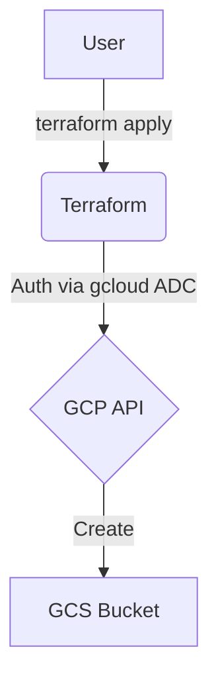
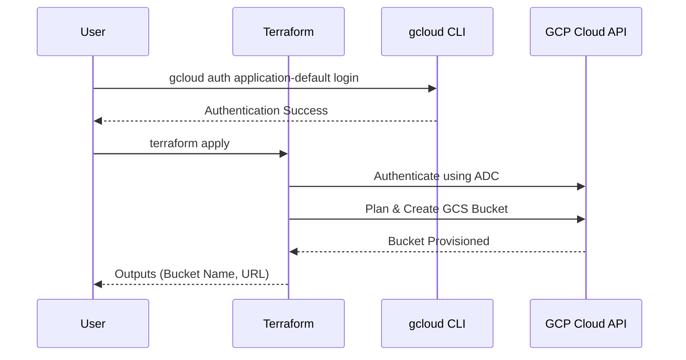

# terraform-gcp-cloud-storage

This Terraform project provisions a Google Cloud Storage (GCS) bucket. 

## Architecture

### Flowchart


### Sequence Diagram


## Bucket Specifications
- **Storage Class**: `STANDARD` (Required for Always Free Tier).
- **Location**: Restricted to `us-west1`, `us-central1`, or `us-east1` (GCP Always Free Tier regions).
- **Uniform Bucket Level Access**: Enabled.
- **Naming**: A random 8-character hex suffix is automatically appended to your `bucket_name` to ensure global uniqueness (e.g., `my-bucket-a1b2c3d4`).
- **Provisioning Only**: This project creates the bucket resource only; no files or objects are uploaded.

## GCP Free Tier Limits (Always Free)
To stay within the free tier, ensure your usage does not exceed:
- **Storage**: 5 GB-months of Standard Storage.
- **Operations**: 5,000 Class A operations and 50,000 Class B operations per month.
- **Data Transfer**: 1 GB of outbound data transfer per month.

## Prerequisites
1.  **Google Cloud SDK**: [Installed and initialized](https://cloud.google.com/sdk/docs/install).
2.  **Terraform**: [Installed](https://developer.hashicorp.com/terraform/downloads).

## Setup & Deployment

1.  **Authenticate and Select Project**:
    Instead of using a service account JSON file, this project uses your local `gcloud` credentials.
    ```bash
    # Authenticate
    gcloud auth application-default login

    # Select your project
    gcloud config set project your-project-id
    ```

2.  **Configure Variables**:
    Create a `terraform.tfvars` file based on the example:
    ```hcl
    project_id  = "your-project-id"
    region      = "us-central1"
    bucket_name = "my-unique-bucket-name"
    ```

3.  **Deploy**:
    ```bash
    # Initialize (required to download the 'random' provider)
    terraform init
    
    # Apply changes
    terraform apply
    ```

4.  **Outputs**:
    After a successful deployment, Terraform will output the bucket name and URL.

## Usage as a Module

Reference this repository as a Terraform module in your own configurations:

> **Option 1**: Terraform Registry (recommended)
> ```hcl
> module "cloud-storage" {
>   source  = "marcuwynu23/cloud-storage/gcp"
>   version = "1.0.0"
>
>   project_id  = var.project_id
>   region      = "us-central1"
>   bucket_name = "my-app-assets"
> }
> ```
>
> **Option 2**: GitHub source
> ```hcl
> module "cloud-storage" {
>   source = "github.com/marcuwynu23/terraform-gcp-cloud-storage?ref=main"
>
>   project_id  = var.project_id
>   region      = "us-central1"
>   bucket_name = "my-app-assets"
> }
> ```

Then use the outputs in your configuration:

```hcl
# Example: pass the bucket URL to a Cloud Run service
resource "google_cloud_run_v2_service" "app" {
  # ...
  template {
    containers {
      env {
        name  = "BUCKET_URL"
        value = module.gcs_bucket.bucket_url
      }
    }
  }
}
```

## Variables

| Variable | Description | Type | Default |
|----------|-------------|------|---------|
| `project_id` | GCP project ID | `string` | (required) |
| `region` | GCP region (free tier: us-west1, us-central1, us-east1) | `string` | `"us-central1"` |
| `bucket_name` | Base bucket name (random suffix appended) | `string` | (required) |

## Outputs

| Output | Description |
|--------|-------------|
| `bucket_name` | Name of the created bucket |
| `bucket_url` | Base URL of the bucket |
| `bucket_self_link` | URI of the created resource |

## Resources Created

- `random_id.bucket_suffix` – Random suffix for globally unique bucket name
- `google_storage_bucket.bucket` – Cloud Storage bucket
## CI/CD Setup (GitHub Actions)

### Prerequisites
1. **Create a GCS bucket** for Terraform remote state:
    ```bash
    gcloud storage buckets create gs://your-terraform-state-bucket \
      --location=us-central1 \
      --uniform-bucket-level-access
    ```

2. **Create a service account** with necessary permissions and generate a JSON key:
    - GCP Console → IAM & Admin → Service Accounts → Create Service Account
    - Grant the required roles for this module
    - Keys → Add Key → Create New Key → JSON
    - Copy the entire JSON file contents

3. **Add GitHub secrets**:

    | Secret Name | Value |
    |---|---|
    | `GCP_SA_KEY` | Full JSON key from step 2 |
    | `TF_BUCKET_NAME` | Your GCS bucket name |
    | `TF_BUCKET_PREFIX` | Bucket prefix/path (e.g., `gcp-cloud-storage`) |

4. **Run the workflow**:
    - **Apply**: Go to Actions → **CD - GCP Cloud Storage (Apply)** → fill in all inputs
    - **Destroy**: Go to Actions → **CD - GCP Cloud Storage (Destroy)** → fill in essential inputs

> Alternatively, create a `backend.tfvars` from `backend.tfvars.example` and run `terraform init -backend-config="backend.tfvars"` for local use.

## Remote State (GCS Backend)

This module uses Google Cloud Storage (GCS) as the Terraform backend for remote state management:

```hcl
terraform {
  backend "gcs" {
    bucket = "your-terraform-state-bucket"
    prefix = "gcp-cloud-storage"
  }
}
```

Create a `backend.tfvars` file based on `backend.tfvars.example` and initialize:

```bash
terraform init -backend-config="backend.tfvars"
```

