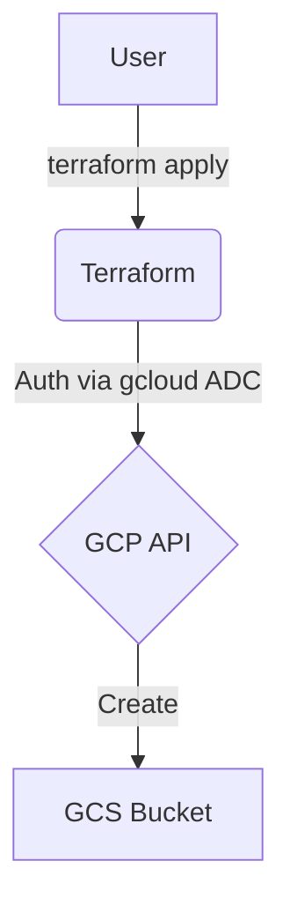
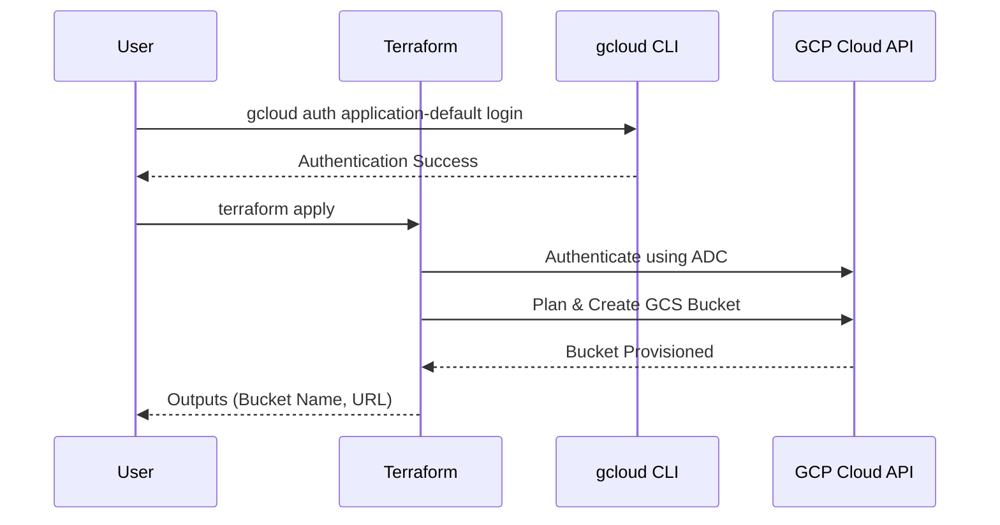

# GCP Cloud Storage Provisioning with Terraform

This Terraform project provisions a Google Cloud Storage (GCS) bucket. It focuses strictly on infrastructure provisioning and does not manage bucket content.

## Architecture

### Flowchart


### Sequence Diagram


## Bucket Specifications
- **Storage Class**: `STANDARD` (Required for Always Free Tier).
- **Location**: Restricted to `us-west1`, `us-central1`, or `us-east1` (GCP Always Free Tier regions).
- **Uniform Bucket Level Access**: Enabled.
- **Naming**: A random 8-character hex suffix is automatically appended to your `bucket_name` to ensure global uniqueness (e.g., `my-bucket-a1b2c3d4`).
- **Provisioning Only**: This project creates the bucket resource only; no files or objects are uploaded.

## GCP Free Tier Limits (Always Free)
To stay within the free tier, ensure your usage does not exceed:
- **Storage**: 5 GB-months of Standard Storage.
- **Operations**: 5,000 Class A operations and 50,000 Class B operations per month.
- **Data Transfer**: 1 GB of outbound data transfer per month.

## Prerequisites
1.  **Google Cloud SDK**: [Installed and initialized](https://cloud.google.com/sdk/docs/install).
2.  **Terraform**: [Installed](https://developer.hashicorp.com/terraform/downloads).

## Setup & Deployment

1.  **Authenticate and Select Project**:
    Instead of using a service account JSON file, this project uses your local `gcloud` credentials.
    ```bash
    # Authenticate
    gcloud auth application-default login

    # Select your project
    gcloud config set project your-project-id
    ```

2.  **Configure Variables**:
    Create a `terraform.tfvars` file based on the example:
    ```hcl
    project_id  = "your-project-id"
    region      = "us-central1"
    bucket_name = "my-unique-bucket-name"
    ```

3.  **Deploy**:
    ```bash
    # Initialize (required to download the 'random' provider)
    terraform init
    
    # Apply changes
    terraform apply
    ```

4.  **Outputs**:
    After a successful deployment, Terraform will output the bucket name and URL.
